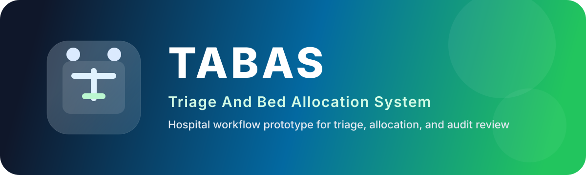

<p align="center"><a href="#tabas-triage-and-bed-allocation-system"></a></p>

<p align="center">
<a href="https://github.com/Jay-kod/tabas"></a>
<a href="https://laravel.com"></a>
<a href="#"></a>
<a href="#"></a>
</p>

# TABAS: Triage And Bed Allocation System

TABAS is a Laravel 11, Inertia, and Vue 3 hospital workflow prototype for triage intake, bed allocation, ward management, and audit review. It is designed as a final-year academic system and includes a simplified triage scoring model for teaching purposes only.

## What it does

- Captures patient intake and vital signs.
- Computes a triage score and urgency category.
- Recommends a vacant bed in the matching ward specialization.
- Lets bed managers accept, override, and manage beds.
- Gives administrators user, ward, and audit oversight.
- Shows doctors pending allocation decisions.
- Provides seeded demo data for all core roles.

## Roles

- Admin
- Triage Nurse
- Bed Manager
- Doctor

## Default demo accounts

All seeded demo users use the password `password`.

- `admin@tabas.test` - TABAS Admin
- `nurse@tabas.test` - Amina Yusuf
- `bedmanager@tabas.test` - David Okafor
- `doctor@tabas.test` - Dr. Chidi Nwosu

## Tech stack

- Laravel 11
- Inertia.js
- Vue 3
- Tailwind CSS
- MySQL-ready schema with SQLite test support

## Core modules

- Authentication and verification
- Nurse triage intake and scoring
- Allocation recommendation and audit logging
- Admin dashboards and CRUD screens
- Bed board management
- Doctor queue review
- Custom application error pages

## Setup

```bash
composer install
npm install
cp .env.example .env
php artisan key:generate
php artisan migrate --seed
npm run build
php artisan serve
```

If you are using XAMPP, point your virtual host or local Apache document root to the `public` directory.

## Test

```bash
php artisan test
npm run build
```

## Notes

- The triage score is intentionally simplified for demonstration and teaching.
- The application includes custom alert toasts, a custom verification screen, and custom error pages.
- Seed data creates wards, beds, sample patients, and example allocations so the app is usable immediately after setup.

## License

This project follows the Laravel ecosystem licensing and depends on the packages listed in `composer.json` and `package.json`.
